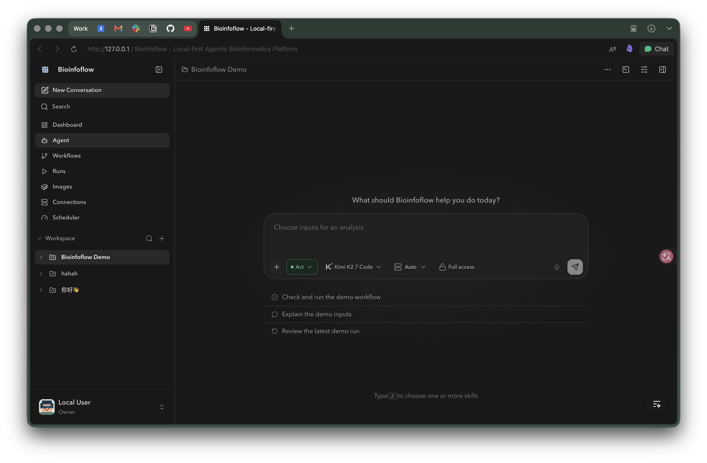

<div align="center">
  

  # Bioinfoflow

  **Run bioinformatics workflows in plain language.**

  A local Agent workspace for bioinformatics analysis.

  Describe the work. The Agent reads your project, prepares inputs, runs
  Nextflow or WDL, follows logs, and explains what happened — on infrastructure
  you control.

  <p>
    <a href="https://discord.gg/bBZB8bFnHB">Discord</a> ·
    <a href="docs/README.md">Docs</a> ·
    <a href="https://bioinfoflow.com">Website</a> ·
    <a href="LICENSE">MIT License</a>
  </p>

  <p><b>English</b> · <a href="README.zh-CN.md">简体中文</a></p>
</div>

## Get started

macOS or Linux with Docker Engine or Docker Desktop.

```bash
curl -fsSL https://github.com/lewismessthecode/BioinfoFlow/releases/latest/download/install.sh | sh
```

Open [localhost:3000](http://localhost:3000), connect a model, and run the
demo workflow.

For development or a customized deployment:

```bash
git clone https://github.com/lewismessthecode/BioinfoFlow.git
cd BioinfoFlow
docker compose up -d --build
```

See the [Docker and installer guide](docs/getting-started/docker.md) for
updates, authentication, remote deployments, GPU setup, and voice input.



_The Agent page keeps the conversation, project workspace, execution target,
and approval controls together._

## Inside Bioinfoflow

| Page | What it is for |
| --- | --- |
| **Workspace** | Keep projects, files, conversations, and analysis context together. |
| **Dashboard** | See system readiness, Docker and GPU status, scheduler activity, and recent runs. |
| **Agent** | Describe a task in plain language; inspect files, prepare work, call tools, and submit approved actions. |
| **Workflows** | Register Nextflow or WDL workflows, manage versions, bind them to projects, and start runs. |
| **Runs** | Follow queue state, logs, DAGs, outputs, retries, resumes, cancellations, cleanup, and audit details. |
| **Images** | View and manage workflow images, pull from registries, upload tarballs, and remove images when allowed. |
| **Connections** | Save SSH profiles, test hosts, stream probes, open remote terminals, use a single jump host, and give the Agent a selected remote target. |
| **Scheduler** | Inspect active runs, queue depth, resource availability, and concurrency. |
| **Settings** | Configure your account, appearance, Agent permissions, AI providers, container registries, and team members. |

Bioinfoflow keeps the project, workflow, execution, logs, and results in one
place. It can work with local data, external project directories, and selected
SSH-connected hosts. Remote Connections support inspection and interactive
terminals; workflow dispatch remains managed by Bioinfoflow's local scheduler.

## GPU workflows

The repository includes NVIDIA Parabricks WGS examples for compatible GPU
setups. A card such as an RTX 4080 SUPER can be used for local GPU workflows;
actual support depends on the workflow, NVIDIA driver, Docker GPU runtime, and
available memory.

See [Parabricks WGS workflows](docs/workflows/parabricks-wgs.md).

## Important boundaries

- The localhost installer binds to loopback and uses development auth. Treat it as a trusted single-user setup.
- Bioinfoflow mounts the Docker socket for image and workflow execution. That gives the backend host-level Docker authority.
- Workflow containers need the same absolute `BIOINFOFLOW_HOME` path as the host and backend.
- SSH commands run with the selected remote account and server policy. A remote project root is a working directory, not a security sandbox.

## Quick links

- [Documentation home](docs/README.md)
- [Remote Connections](docs/guides/remote-connections.md)
- [Storage and data layout](docs/concepts/storage.md)
- [Architecture](docs/architecture.md)
- [CLI reference](docs/reference/cli.md)
- [Runbook](RUNBOOK.md)

## Development

See [AGENTS.md](AGENTS.md) for repository conventions and verification commands.

## License

Bioinfoflow is released under the [MIT License](LICENSE).
