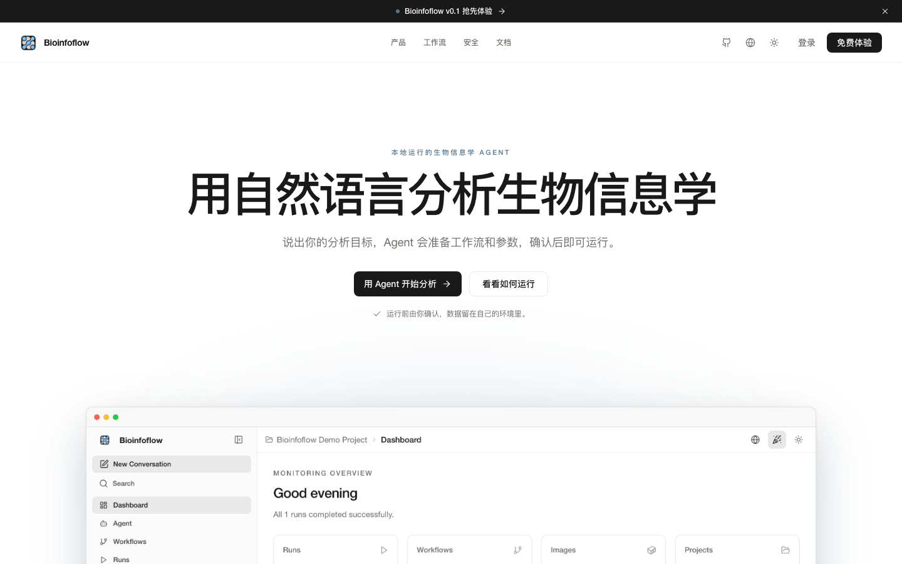

<p align="center">
  
</p>

<h1 align="center">Bioinfoflow</h1>

<p align="center">
  <strong>让 Agent 真正看得见、跑得动你的生信工作流。</strong>
</p>

<p align="center">
  不用再把文件片段、报错和命令来回复制到聊天框里。Agent 可以直接查看项目文件、
  准备输入、运行 Nextflow 或 WDL、跟踪日志和 DAG，并结合完整上下文解释结果。
  整个平台仍然运行在你自己的基础设施上。
</p>

<p align="center">
  <a href="https://discord.gg/bBZB8bFnHB"></a>
  <a href="docs/README.md"></a>
  <a href="https://bioinfoflow.com"></a>
  <a href="LICENSE"></a>
</p>

<p align="center">
  <a href="README.md">English</a> | <b>简体中文</b>
</p>

<p align="center">
  
</p>

## 什么时候值得用 Bioinfoflow？

如果你只需要执行一条 Nextflow 或 MiniWDL 命令，现有工具可能已经够用。

Bioinfoflow 更适合另一种情况：命令不难，难的是把样本、参数、容器、工作目录、
运行记录、日志和结果始终放在同一个上下文里。尤其是任务失败以后，你还需要知道
它为什么失败、能不能安全重试，以及这批结果究竟是怎么得到的。

| 你可能会喜欢 Bioinfoflow，如果你…… | 它可能不适合你，如果你…… |
| --- | --- |
| 在自己的工作站、服务器或计算资源上开发和运行生信工作流 | 已经习惯只用工作流引擎和目录管理全部内容 |
| 希望关掉终端以后，仍然能追溯一次运行发生了什么 | 想要开箱即用的托管分析服务 |
| 想在一个地方查看文件、输入、DAG、日志和结果 | 需要开箱即用的多租户平台，并且不想自己运维 |
| 希望 Agent 能查看真实项目状态，但关键操作仍由人确认 | 希望 Agent 不经确认就能自由操作基础设施 |

Bioinfoflow 主要面向独立研究者、生信工程师、工作流开发者，以及使用工作站、
实验室服务器或 SSH 计算资源的小型技术团队。

## 现在如何安装

你需要：

- macOS 或 Linux
- Docker Engine 或 Docker Desktop，并支持 Docker Compose
- `amd64` 或 `arm64` 机器

在可信的本机上，最短安装方式是一行命令：

```bash
curl -fsSL https://github.com/lewismessthecode/BioinfoFlow/releases/latest/download/install.sh | sh
```

这条命令始终安装经过测试的最新数字版本，不会安装浮动的开发镜像。如果 3000 或
8000 端口已被占用，安装器会显示监听进程；无需结束该进程，可以改用两个空闲端口：

```bash
curl -fsSL https://github.com/lewismessthecode/BioinfoFlow/releases/latest/download/install.sh | FRONTEND_PORT=3100 BACKEND_PORT=8100 sh
```

安装器会校验正式版本资产、拉取匹配当前架构的镜像，然后打开
<http://localhost:3000>。本机版只监听 `127.0.0.1`，持久化数据保存在
`~/.bioinfoflow`，并在首次安装时写入原生 NGS skills；进入 Agent 时不显示
Bioinfoflow 登录页。不要通过反向代理、端口转发或公网 Docker 主机暴露这个无登录
的本机模式。

更新、卸载、指定版本、检查校验和以及源码安装说明，见
[Docker 与安装器指南](docs/getting-started/docker.md)。

开发 Bioinfoflow，或配置多人使用、远程访问的部署时，请改为从源码启动：

```bash
git clone https://github.com/lewismessthecode/BioinfoFlow.git
cd BioinfoFlow
docker compose up -d --build
```

本机首次运行不需要 `.env`。源码版 Compose 默认只监听 `127.0.0.1`、使用开发认证、
自动创建 SQLite 所需目录，并允许你启动后从 UI 连接模型。只有需要覆盖默认值时，
才把 `.env.example` 复制为 `.env`。

共享或远程部署前，必须显式配置 personal 或 team 认证、初始管理员、稳定的认证与
凭据密钥、公开 URL、CORS Origins 和 Trusted Hosts，并通过 TLS 对外提供服务。
完整安全边界见[运行手册](RUNBOOK.md)。

启动后打开 <http://localhost:3000>。本机源码版和一行安装版都会直接以开发认证
模式打开 Agent。

## 三步跑完第一个演示

首次启动时，Bioinfoflow 会自动准备好一个 `Bioinfoflow Demo` 项目，其中已经有：

- 已注册的 WDL 工作流
- 一份样本表
- 两个很小的 FASTQ 文件
- 可以直接点击的 Agent 快捷指令

你只需要：

1. 在 Agent 输入框里点击**连接模型**，填入模型服务商的 API Key。
2. 点击**检查并运行演示工作流**。
3. 查看 Agent 给出的计划，确认后提交运行。

Agent 会先检查这些文件，再通过 Bioinfoflow 的内置工具准备任务。真正提交任务前，
它会停下来等你确认；任务开始后，它还能继续查看日志、DAG 和输出结果。

OpenAI、Anthropic 和 DeepSeek 可以直接从 Agent 输入框连接。Kimi、Kimi China、
Gemini、OpenRouter、Ollama、vLLM 以及其他兼容接口，可以在
**设置 → AI 服务商**中配置。

### 可选：语音输入

语音模型与 Bioinfoflow 主服务分开运行。浏览器负责录音，Bioinfoflow 后端统一转换
音频格式，再调用一个兼容 OpenAI Audio API 的 ASR 服务；Fun-ASR 或 Whisper 不会
被加载进 Bioinfoflow 后端进程。

```text
浏览器 → Bioinfoflow 后端 → 独立 ASR 服务 → 可编辑的输入框文字
```

源码版 Compose 提供两个按需启动的 sidecar：中文和 Linux NVIDIA GPU 优先选择
Fun-ASR；普通 CPU 或多语言场景选择 faster-whisper；也可以显式配置外部云端接口。
只需启动当前使用的一个本地模型，普通的 Bioinfoflow 启动命令不会自动下载模型。

配置和启动命令见[语音输入部署说明](docs/deployment/voice-dictation.md)。目前一行命令
安装的 localhost 版本尚未打包本地 ASR sidecar；如果要使用内置 Fun-ASR 或
faster-whisper，请使用源码版 Compose 部署。

## Agent 不是旁边多出来的聊天框

它和 Bioinfoflow 共用同一套项目、工作流注册信息、文件、运行历史、调度状态、
镜像、技能和远程连接。Agent 看到的是项目里的真实状态，调用的也是 Bioinfoflow
自己的工具；需要提交或取消任务时，仍会先征求你的确认。

```text
你提出分析需求
      ↓
Agent 查看项目文件、工作流、输入和历史运行
      ↓
说明计划并准备参数
      ↓
在当前项目和权限范围内调用 Bioinfoflow 工具
      ↓
遇到提交、取消等关键操作时，请求你的批准
      ↓
继续跟踪事件、日志、DAG 和输出
      ↓
解释结果，或定位失败原因
```

查看文件、整理信息等只读操作可以直接进行；提交或取消任务等会产生实际影响的操作，
仍然受权限策略和审批机制约束。对话、工具调用、运行事件和产物都会留有记录；
只有经过你确认的内容才会写入长期记忆。

## 一个项目，把一次分析需要的上下文放在一起

### 数据放在哪里，由你决定

项目可以使用 Bioinfoflow 管理的存储，也可以直接使用已有的本地目录，或者通过 SSH
连接远程计算资源。无论数据放在哪里，文件、工作流、对话、运行历史和结果都收在
同一个项目下，不会散落到彼此无关的页面和目录里。

### 一次运行，之后仍然看得懂

工作流注册一次后，可以从 Web 界面、`bif` CLI 或 Agent 发起。持久化调度器负责
并发、资源、重试、超时、清理和服务重启后的恢复；每次运行的输入、事件、DAG、
日志、审计记录和结果会保存在一起。

Nextflow 与 WDL/MiniWDL 使用同一套项目和运行模型。切换执行引擎时，项目、
运行记录和结果仍然可以沿用。

### 本地掌控，也能按需连接远程资源

Bioinfoflow 运行在你管理的基础设施上。你可以在浏览器终端中操作，也可以用
`bif` CLI 编写脚本，或通过 SSH 连接远程计算资源。平台不会因此变成托管式数据服务；
远程命令仍然受实际使用的 SSH 身份、选中的连接和 Agent 权限策略限制。

## 使用前需要了解的安全边界

- 本机一行安装模式只监听 `127.0.0.1`，不需要注册 Bioinfoflow 云端账号，也不用
  单独安装数据库。
- 研究数据不必离开你控制的基础设施。如果使用云端模型，发送给模型的提示词和上下文
  仍然受对应服务商的数据政策约束。
- 不使用 Agent 时，不需要配置任何模型；使用 Agent 时，需要连接一个云端模型或本地
  兼容模型。
- 执行工作流时，后端会挂载 Docker socket，因此具备主机级的容器控制能力。请只在
  可信机器和可信网络中运行。
- 公网、远程或团队部署仍然需要认证、稳定密钥、TLS、可信来源、备份和常规安全加固。
  本机一行安装模式不会替你完成这些生产环境配置。

如果准备让其他用户访问 Bioinfoflow，请先阅读[安全说明](docs/security.md)、
[存储模型](docs/concepts/storage.md)和[运维手册](docs/operations/runbook.md)。

## 其他运行方式

### 自定义源码部署

源码部署默认适合无登录的本机开发，也可以定制为带登录的个人或团队环境、自定义访问
地址，或者修改前端构建配置。团队或远程部署还需要设置稳定的
`BIOINFOFLOW_CREDENTIAL_KEY`，
配置实际访问地址和可信来源，启用 TLS，并在开放端口前阅读安全说明。

预构建镜像、自定义数据目录、GPU 和其他部署方式见
[Docker 指南](docs/getting-started/docker.md)；配置优先级与故障排查见
[运行手册](RUNBOOK.md)。

### 命令行

`bif` 是 Bioinfoflow 后端的命令行客户端，需要先启动后端服务：

```bash
cd backend
uv run bif doctor
uv run bif project list
uv run bif workflow list
uv run bif run list
uv run bif --output json run show <run-id>
```

使用 `--base-url` 或 `BIOFLOW_API_URL` 可以连接其他后端。完整命令见
[CLI 参考](docs/reference/cli.md)。

## 本地开发

```bash
# 启动后端
cd backend
uv sync
uv run alembic upgrade head
uv run uvicorn app.main:app --reload --reload-dir app --port 8000

# 在另一个终端启动前端
cd frontend
bun install
bun run dev
```

后端会在启动时加载环境配置，仓库根目录的 `.env` 是默认配置源，`backend/.env`
可用于本机覆盖。修改后需要重启后端；如果改了 `NEXT_PUBLIC_*` 配置，还要重启或
重新构建前端，因为这些值会写进前端产物。

- 后端检查：`uv run pytest && uv run ruff check .`
- 前端检查：`bun run lint && bun run test`

## 文档

- [文档首页](docs/README.md)
- [Docker 与安装器指南](docs/getting-started/docker.md)
- [语音输入部署说明](docs/deployment/voice-dictation.md)
- [运行手册](RUNBOOK.md)
- [架构说明](docs/architecture.md)
- [存储与数据布局](docs/concepts/storage.md)
- [远程连接](docs/guides/remote-connections.md)
- [nf-core/rnaseq 示例](demo/nfcore-rnaseq/README.md)

## 开源协议

Bioinfoflow 采用 [MIT License](LICENSE)。
