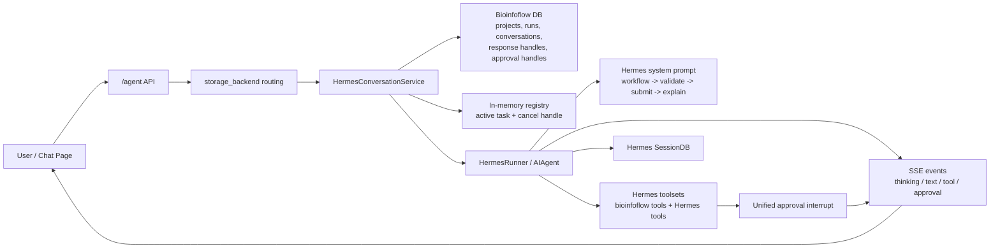
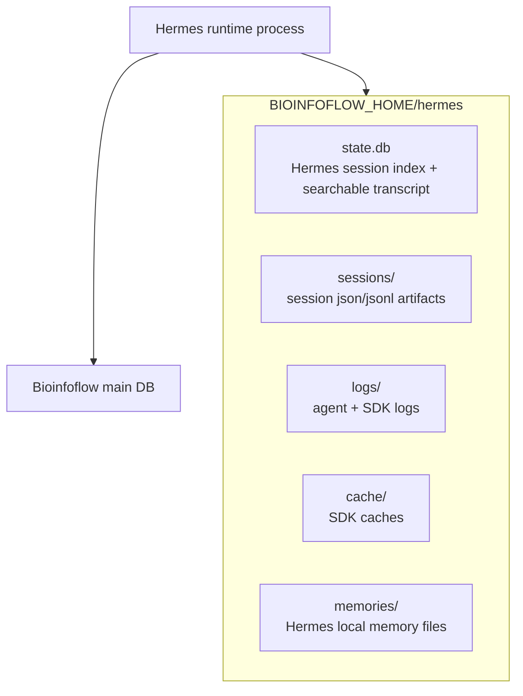

# Hermes Managed Home And Chat-First UX

## Summary

This note captures the current Hermes integration shape after moving it to a
managed `BIOINFOFLOW_HOME/hermes` directory model. Bioinfoflow keeps its main
application database for product state, while Hermes owns the conversation
transcript, session artifacts, and SDK-local runtime files under one managed
home.

## Product Flow

## Managed Home Layout

## Chat-First UX

- Keep one assistant message per response.
- Append `thinking`, `tool-call`, `approval`, and final text into that same
  message thread.
- Treat risky tools like real interrupts: `submit_run` starts, pauses for
  approval, then resumes in place after approval.
- Use structured tool results so the chat UI can render concise previews instead
  of raw Python strings.
